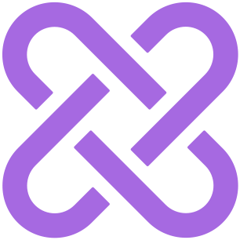

<!-- Improved compatibility of back to top link: See: https://github.com/othneildrew/Best-README-Template/pull/73 -->
<a id="readme-top"></a>
<!--
*** Thanks for checking out the Best-README-Template. If you have a suggestion
*** that would make this better, please fork the repo and create a pull request
*** or simply open an issue with the tag "enhancement".
*** Don't forget to give the project a star!
*** Thanks again! Now go create something AMAZING! :D
-->


<!-- PROJECT SHIELDS -->
<!--
*** I'm using markdown "reference style" links for readability.
*** Reference links are enclosed in brackets [ ] instead of parentheses ( ).
*** See the bottom of this document for the declaration of the reference variables
*** for contributors-url, forks-url, etc. This is an optional, concise syntax you may use.
*** https://www.markdownguide.org/basic-syntax/#reference-style-links
-->


<!-- PROJECT LOGO -->
<br />
<div align="center">
  <a href="https://github.com/CGodl/GealAi">
    
  </a>

<h3 align="center">GealAi</h3>

  <p align="center">
    GealAI is a project developed to allow users all-in-one access to various AI features from OpenAI and Replicate AI including text, conversation, image generation, and video generation.
    <br />
    <a href="https://github.com/CGodl/GealAi"><strong>Explore the docs »</strong></a>
    <br />
    <br />
    <a href="https://github.com/CGodl/GealAi">View Demo</a>
    ·
    <a href="https://github.com/CGodl/GealAi/issues/new?labels=bug&template=bug-report---.md">Report Bug</a>
    ·
    <a href="https://github.com/CGodl/GealAi/issues/new?labels=enhancement&template=feature-request---.md">Request Feature</a>
  </p>
</div>


<!-- TABLE OF CONTENTS -->
<details>
  <summary>Table of Contents</summary>
  <ol>
    <li>
      <a href="#about-the-project">About The Project</a>
      <ul>
        <li><a href="#built-with">Built With</a></li>
      </ul>
    </li>
    <li>
      <a href="#getting-started">Getting Started</a>
      <ul>
        <li><a href="#prerequisites">Prerequisites</a></li>
        <li><a href="#installation">Installation</a></li>
      </ul>
    </li>
    <li><a href="#usage">Usage</a></li>
    <li><a href="#contributing">Contributing</a></li>
    <li><a href="#license">License</a></li>
    <li><a href="#contact">Contact</a></li>
    <li><a href="#acknowledgments">Acknowledgments</a></li>
  </ol>
</details>


<!-- ABOUT THE PROJECT -->
## About The Project

[![Product Name Screen Shot][product-screenshot]](https://gael-ai.vercel.app/)

<p align="right">(<a href="#readme-top">back to top</a>)</p>


### Built With

* [![Next][Next.js]][Next-url]
* [![React][React.js]][React-url]
* [![TailwindCss][Tailwindscss.com]][TailwindCss-url]

<p align="right">(<a href="#readme-top">back to top</a>)</p>


<!-- GETTING STARTED -->
## Getting Started

To get a local copy up and running follow these simple example steps.

### Prerequisites

* npm
  ```sh
  npm install npm@latest -g
  ```

### Installation

1. Get API Keys for Clerk at [https://clerk.com/](https://clerk.com/), OpenAI at [https://openai.com/](https://openai.com/), ReplicateAI at [https://replicate.com/](https://replicate.com/), Supabase at [https://supabase.com/](https://supabase.com/), and Stripe at [https://stripe.com/](https://stripe.com/)
2. Clone the repo
   ```sh
   git clone https://github.com/CGodl/GealAi.git
   ```
3. Install NPM packages
   ```sh
   npm install
   ```
4. Create a `.env` file in the root of the directory

5. Enter the following API variables and associated keys in `.env`
   ```js
    NEXT_PUBLIC_CLERK_PUBLISHABLE_KEY
    NEXT_PUBLIC_CLERK_SIGN_IN_URL=/sign-in
    NEXT_PUBLIC_CLERK_SIGN_UP_URL=/sign-up
    NEXT_PUBLIC_CLERK_AFTER_SIGN_IN_URL=/dashboard
    NEXT_PUBLIC_CLERK_AFTER_SIGN_UP_URL=/dashboard

    CLERK_SECRET_KEY
    OPENAI_API_KEY
    REPLICATE_API_TOKEN
    DATABASE_URL
    DIRECT_URL
    STRIPE_API_KEY
    STRIPE_API_TEST_KEY
    STRIPE_WEBHOOK_SECRET

    NEXT_PUBLIC_APP_URL
   ```

<p align="right">(<a href="#readme-top">back to top</a>)</p>


First, run the development server:

```bash
npm run dev
# or
yarn dev
# or
pnpm dev
# or
bun dev
```

Open [http://localhost:3000](http://localhost:3000) with your browser to see the result.

You can start editing the page by modifying `app/page.tsx`. The page auto-updates as you edit the file.

This project uses [`next/font`](https://nextjs.org/docs/basic-features/font-optimization) to automatically optimize and load Inter, a custom Google Font.

## Deploy on Vercel

The easiest way to deploy your Next.js app is to use the [Vercel Platform](https://vercel.com/new?utm_medium=default-template&filter=next.js&utm_source=create-next-app&utm_campaign=create-next-app-readme) from the creators of Next.js.

Check out our [Next.js deployment documentation](https://nextjs.org/docs/deployment) for more details.

<!-- CONTRIBUTING -->
## Contributing

Contributions are what make the open source community such an amazing place to learn, inspire, and create. Any contributions you make are **greatly appreciated**.

If you have a suggestion that would make this better, please fork the repo and create a pull request. You can also simply open an issue with the tag "enhancement".
Don't forget to give the project a star! Thanks again!

1. Fork the Project
2. Create your Feature Branch (`git checkout -b feature/AmazingFeature`)
3. Commit your Changes (`git commit -m 'Add some AmazingFeature'`)
4. Push to the Branch (`git push origin feature/AmazingFeature`)
5. Open a Pull Request

<p align="right">(<a href="#readme-top">back to top</a>)</p>


<!-- CONTACT -->
## Contact

Carl Godlewski - cgodlew@gmail.com

Project Link: [https://github.com/CGodl/GealAi](https://github.com/CGodl/GealAi)

<p align="right">(<a href="#readme-top">back to top</a>)</p>


<!-- ACKNOWLEDGMENTS -->
## Acknowledgments

* [Original Tutorial Inspiration ](https://www.youtube.com/watch?v=ffJ38dBzrlY&list=PLt9Yvx4vNpSjgkKbfEa_XrmbfsOOdLrsI)

<p align="right">(<a href="#readme-top">back to top</a>)</p>


[![Contributors][contributors-shield]][contributors-url]
[![Forks][forks-shield]][forks-url]
[![Stargazers][stars-shield]][stars-url]
[![Issues][issues-shield]][issues-url]
[![MIT License][license-shield]][license-url]
[![LinkedIn][linkedin-shield]][linkedin-url]


<!-- MARKDOWN LINKS & IMAGES -->
<!-- https://www.markdownguide.org/basic-syntax/#reference-style-links -->
[contributors-shield]: https://img.shields.io/github/contributors/CGodl/GealAi.svg?style=for-the-badge
[contributors-url]: https://github.com/CGodl/GealAi/graphs/contributors
[forks-shield]: https://img.shields.io/github/forks/CGodl/GealAi.svg?style=for-the-badge
[forks-url]: https://github.com/CGodl/GealAi/network/members
[stars-shield]: https://img.shields.io/github/stars/CGodl/GealAi.svg?style=for-the-badge
[stars-url]: https://github.com/CGodl/GealAi/stargazers
[issues-shield]: https://img.shields.io/github/issues/CGodl/GealAi.svg?style=for-the-badge
[issues-url]: https://github.com/CGodl/GealAi/issues
[license-shield]: https://img.shields.io/github/license/CGodl/GealAi.svg?style=for-the-badge
[license-url]: https://github.com/CGodl/GealAi/blob/master/LICENSE.txt
[linkedin-shield]: https://img.shields.io/badge/-LinkedIn-black.svg?style=for-the-badge&logo=linkedin&colorB=555
[linkedin-url]: https://linkedin.com/in/carlgodlewski
[product-screenshot]: public/splashPageScreen.png
[Next.js]: https://img.shields.io/badge/next.js-000000?style=for-the-badge&logo=nextdotjs&logoColor=white
[Next-url]: https://nextjs.org/
[React.js]: https://img.shields.io/badge/React-20232A?style=for-the-badge&logo=react&logoColor=61DAFB
[React-url]: https://reactjs.org/
[Vue.js]: https://img.shields.io/badge/Vue.js-35495E?style=for-the-badge&logo=vuedotjs&logoColor=4FC08D
[Vue-url]: https://vuejs.org/
[Angular.io]: https://img.shields.io/badge/Angular-DD0031?style=for-the-badge&logo=angular&logoColor=white
[Angular-url]: https://angular.io/
[Svelte.dev]: https://img.shields.io/badge/Svelte-4A4A55?style=for-the-badge&logo=svelte&logoColor=FF3E00
[Svelte-url]: https://svelte.dev/
[Tailwindscss.com]: https://img.shields.io/badge/tailwindcss-0F172A?style=for-the-badge&logo=tailwindcss
[TailwindCss-url]: https://tailwindcss.com/


